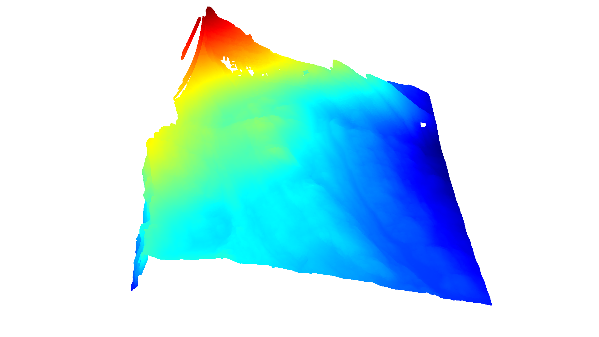
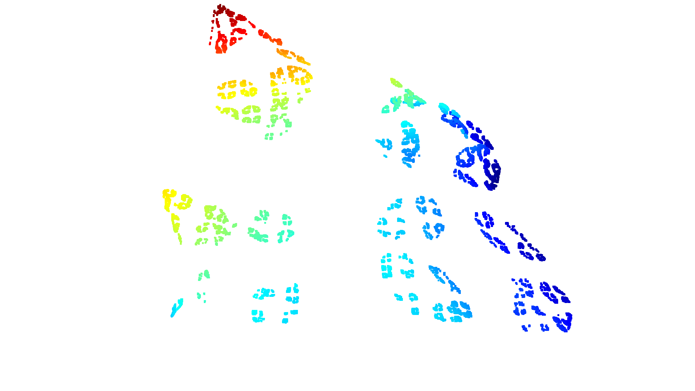

# OctreeSpheres Project
## Description
This project processes LAS files using a modified Octree algorithm and visualizes the results. This is the original task which this project is trying to solve:
>Your task is to implement a modified Octree algorithm. The algorithm should construct a standard Octree, but we want you to embed a sphere in each of the Octree cubes. All the points within a sphere should further be subdivided into eight cubes (with spheres inside). All the points that are outside of the sphere can be discarded. Visualize the results
## Results
Below you can see the original point cloud that was provided in the [sample file](https://drive.google.com/file/d/1LgWT31UbIbYiZAT4_v_PoDKKQg5P7Mua/view):

After running the script a modified octree algorithm is applied and this is the result:

## Setup and Installation
#### 1. Setting Up a Virtual Environment:
Before you begin, ensure you have python and pip installed. Once that's done, you can set up a virtual environment for the project:
```
# Create a virtual environment named 'venv'
python -m venv venv

# Activate the virtual environment
# On Windows:
venv\Scripts\activate

# On macOS and Linux:
source venv/bin/activate
```
#### 2. Install the Required Packages:
With the virtual environment activated, install the required packages using the requirements.txt file:
```
pip install -r requirements.txt
```
#### 3. Provide the LAS File:
The script expects a file named sample.las to be present in the working directory. Ensure that you have placed the sample.las file in the same directory as the script.
## Running the Script
After setting up, you can run the script using:
```
python script.py
```